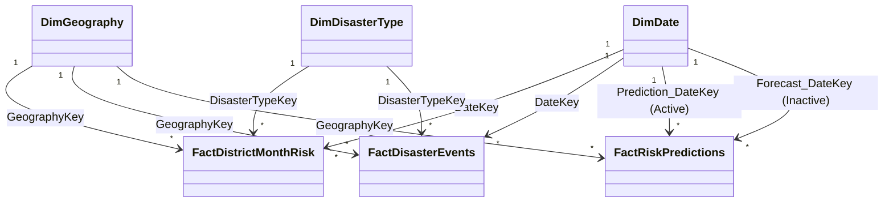

# Disaster Risk Prediction Analytics Framework — Power BI Assemble & Build Guide

This document provides complete instructions to set up, relate, and style the 6-page interactive report using the exported Star Schema CSV tables.

---

## 1. Data Model & Relationships (Star Schema)

Import the 6 CSV tables from `data/` into Power BI:
1. **FactDistrictMonthRisk.csv**: Monthly panel observations (13,200 rows).
2. **FactDisasterEvents.csv**: Disaster impact variables for event months only (2,764 rows).
3. **FactRiskPredictions.csv**: Calibrated probability forecasts and expected economic risk.
4. **DimGeography.csv**: Baseline district geographic profiles, K-means clusters, and Policy Quadrants (100 rows).
5. **DimDate.csv**: Monthly calendar table (132 rows).
6. **DimDisasterType.csv**: Dimension lookup for hazard categories (no blanks, starts with "No Disaster").

### Relationships Setup
Establish the relationships in the Power BI Model view:

* **DimGeography** to Fact Tables:
  - `DimGeography[GeographyKey]` 1 ── * `[GeographyKey]` (Single Filter Direction)
* **DimDate** to Fact Tables:
  - `DimDate[DateKey]` 1 ── * `[DateKey]` / `[Prediction_DateKey]` (Single Filter Direction)
* **DimDisasterType** to Fact Tables:
  - `DimDisasterType[DisasterTypeKey]` 1 ── * `[DisasterTypeKey]` (Single Filter Direction)

---

## 2. Emergency Management Visual Theme

Create a custom JSON theme file (`power_bi/theme.json`) or configure the Custom Theme panel with these hex values:
- **Low Risk**: `#2ECC71` (Vibrant Green)
- **Moderate Risk**: `#F1C40F` (Amber Yellow)
- **High Risk**: `#E67E22` (Orange)
- **Critical Risk**: `#E74C3C` (Crimson Red)
- **Theme Core Dark**: `#2C3E50` (Slate Blue)
- **Grid Background**: `#F8F9FA` (Soft Grey)

---

## 3. Page-by-Page Construction Specifications

### Page 1: Executive Overview
* **Purpose**: High-level panel showing historical event frequency, impact metrics, and descriptive risk indexes.
* **Key Visuals**:
  1. **KPI Cards (Top row)**: `Total Events`, `Total Deaths`, `Total People Affected`, `Total Economic Loss (M USD)`, `Average Disaster Risk Score`.
  2. **Filled Map**:
     - Location: `DimGeography[State]` or `DimGeography[District]`
     - Tooltip: `Average Disaster Risk Score`, `Total Events`
  3. **Seasonal Donut Chart**:
     - Legend: `DimDate[Season]`
     - Values: `Total Events`
  4. **Top-10 Risk Districts**:
     - Visual: Horizontal Bar Chart
     - Axis: `DimGeography[District]`
     - Values: `Average Disaster Risk Score` (Top 10 filter)

### Page 2: Geographical Hotspots
* **Purpose**: Map out spatial patterns and identify preparedness deficits.
* **Key Visuals**:
  1. **Bubble Map**:
     - Location: `DimGeography[Latitude]`, `DimGeography[Longitude]`
     - Bubble Size: `Total Events`
     - Bubble Color: `DimGeography[Policy_Quadrant]`
  2. **Preparedness Scatterplot**:
     - X-Axis: `AVERAGE(FactDistrictMonthRisk[Preparedness_Score])`
     - Y-Axis: `Average Disaster Risk Score`
     - Details: `DimGeography[District]`
     - *Interpretation*: The upper-left quadrant isolates high-risk, low-preparedness districts.
  3. **Administrative Priority Table**:
     - Columns: `District`, `State`, `Region`, `Policy_Quadrant`, `Risk_Preparedness_Gap`.

### Page 3: Trends & Seasonality
* **Purpose**: Highlight annual event distributions and monsoon-driven seasonal patterns.
* **Key Visuals**:
  1. **Chronological Line Chart**:
     - Axis: `DimDate[Year]` & `DimDate[Month_Name]`
     - Values: `Total Events`
     - Legend: `DimDisasterType[Disaster_Type]`
  2. **Monthly Seasonal Profile (Column Chart)**:
     - Axis: `DimDate[Month_Name]` (sorted chronologically)
     - Values: `Total Events`
     - Legend: `DimDisasterType[Disaster_Type]`

### Page 4: Vulnerability & Capacity
* **Purpose**: Deep-dive into socioeconomic vulnerability drivers and emergency shelter/hospital capacity rates.
* **Key Visuals**:
  1. **Socioeconomic Scatterplot**:
     - X-Axis: `AVERAGE(DimGeography[Poverty_Rate])`
     - Y-Axis: `Total Economic Loss (M USD)`
     - Legend: `DimGeography[Policy_Quadrant]`
  2. **Facility Capacity Rates**:
     - Column Chart: `Hospital_Rate_per_100k`, `Shelter_Rate_per_100k` by `District`.

### Page 5: Predictive Model & Early Warning
* **Purpose**: Present next-month disaster alert warning classifications and model calibration diagnostics.
* **Key Visuals**:
  1. **Inference Forecast KPI Cards**:
     - `Average Forecast Probability`
     - `Active Alerts` (Count of districts flagged 1 for next month)
     - `Brier Skill Score` (BSS, verifying model probability calibration)
  2. **Early Warning Alert Table (Main Grid)**:
     - Columns: `DimGeography[District]`, `DimGeography[State]`, `DimGeography[Policy_Quadrant]`, `Predicted_Disaster_Probability` (Calibrated), `Alert_Level`, `Expected_Economic_Risk_M_USD`.
     - Filter: `Predicted_Disaster_Class` = 1 (Active Alerts).
     - Conditional Formatting: Alert_Level = "Critical" highlighted in red.
  3. **SHAP Feature Contribution**:
     - Visual: Horizontal Bar Chart.
     - Value: `mean_abs_shap` from `outputs/cluster_summary.json` (Rainfall Anomaly, Season, Coastal Proximity, etc.).

### Page 6: Response & Logistics Planning
* **Purpose**: Allocate emergency relief supplies based on Expected Economic Risk ($P(\text{Disaster}) \times E(\text{Loss} | \text{Disaster})$).
* **Key Visuals**:
  1. **Treemap of expected loss**:
     - Group: `DimGeography[Region]`
     - Values: `Expected_Economic_Risk_M_USD`
  2. **Priority Intervention Matrix**:
     - Rows: `DimGeography[Policy_Quadrant]`
     - Columns: `Alert_Level`
     - Values: `Expected_Economic_Risk_M_USD` (Highlighting Priority 1 quadrant).
